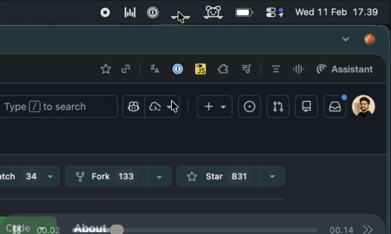

# Shy

A minimal macOS menu bar utility that toggles the system's "auto-hide menu bar" setting. Left-click the shy piggy to toggle, right-click to quit. No dock icon, no windows, no settings.

macOS Tahoe (26.x) only.



## Build

```
make
```

## Run

```
make run
```

## Install

```
make install
```

Copies `Shy.app` to `/Applications/`.

## Download

Grab the latest `Shy.zip` from the [Releases](../../releases) page, unzip it, and drag `Shy.app` to your `/Applications/` folder.

Since the app is not signed with an Apple Developer certificate, macOS Gatekeeper will block it on first launch. To open it:

1. Right-click (or Control-click) `Shy.app`
2. Select **Open** from the context menu
3. Click **Open** in the dialog that appears

You only need to do this once — macOS remembers your choice after that.

Alternatively, you can remove the quarantine flag from the terminal:

```
xattr -cr /Applications/Shy.app
```

## Packaging a release

To create a distributable zip:

```
make package
```

This produces `build/Shy.zip`. To publish it as a GitHub Release:

```bash
# Tag the version
git tag v1.0.0
git push origin v1.0.0

# Create the release with the zip attached
gh release create v1.0.0 build/Shy.zip --title "Shy v1.0.0" --notes "Release notes here"
```
